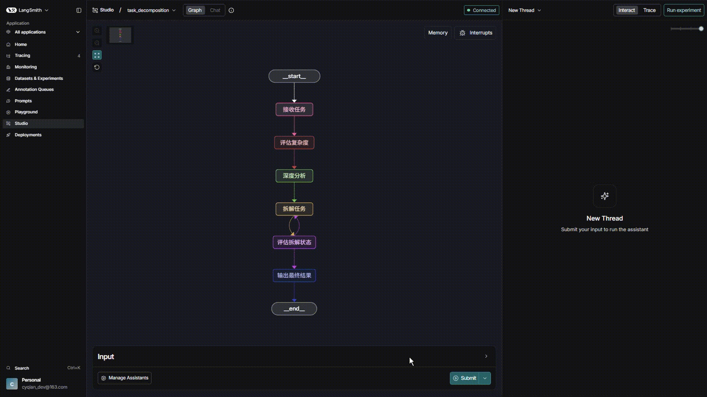

# 智能任务拆解系统

## 🚀LangSmith 流程演示

## 项目简介

这是一个基于 LangGraph 的智能任务拆解系统，能够将复杂的任务自动分解为具体可执行的子任务，帮助您更有效地规划和执行工作。

## 主要功能

### 🎯 任务拆解
- **自动分析**：系统会智能评估任务的复杂度
- **深度分析**：对复杂任务进行详细分析，识别关键目标和挑战
- **多层级拆解**：将任务拆解为N层结构，确保每个子任务都足够具体可执行
- **智能判断**：自动判断子任务是否需要进一步拆解

### 📊 报告生成
- **详细报告**：生成包含所有子任务的完整拆解报告
- **层级展示**：按层级清晰展示拆解结果
- **可执行任务清单**：单独列出可立即执行的任务
- **报告保存**：自动将报告保存为文本文件，方便后续查看

### 🚀 适用场景
- **市场营销**：如「制定618促销方案」、「双11市场营销战略」等
- **项目管理**：如「新产品上线规划」、「季度工作总结」等
- **个人规划**：如「年度学习计划」、「旅行行程安排」等
- **任何需要结构化规划的任务**

## 示例

输入：`制定双11市场营销战略`

输出：
- 任务复杂度评估
- 深度分析结果
- 第一层拆解（3个主要子任务）
- 第二层拆解（每个子任务的具体步骤）
- 可执行任务清单
- 完整报告文件

## 核心功能特性

### LangGraph 核心技术特性

#### 🔄 循环机制
- **智能迭代**：系统能够根据任务复杂度自动进行多轮拆解，直到所有子任务都足够具体可执行
- **层级控制**：通过设置最大拆解层级，确保拆解过程不会无限递归，保持系统稳定性
- **队列管理**：使用处理队列机制，有序管理待拆解的任务，确保拆解过程的逻辑性和完整性

#### 📝 条件边控制流
- **智能判断**：系统会自动判断子任务是否需要进一步拆解，实现动态控制流
- **复杂度评估**：根据任务复杂度采用不同的拆解策略，复杂任务会获得更详细的分析和拆解
- **状态驱动**：基于当前任务状态决定下一步操作，实现灵活的工作流控制

#### 🗃️ 状态管理
- **统一状态容器**：使用AgentState统一管理工作流状态，确保数据一致性
- **实时状态更新**：在每个节点执行完成后实时更新状态，为后续节点提供准确的上下文信息
- **状态持久化**：支持将拆解结果保存到本地文件，便于后续查看和使用

#### 🔗 节点间通信模式
- **数据传递**：通过状态容器在节点间传递数据，确保信息流畅通
- **上下文共享**：所有节点共享同一状态上下文，避免信息孤岛
- **结果反馈**：每个节点的执行结果都会反馈到状态容器，影响后续节点的执行逻辑

## 技术特点

- **智能分析**：使用先进的AI模型进行任务分析和拆解
- **用户友好**：实时展示拆解过程，让您了解系统的思考逻辑
- **灵活配置**：可根据需要调整拆解深度和其他参数
- **报告详尽**：生成的报告结构清晰，便于执行和跟踪

